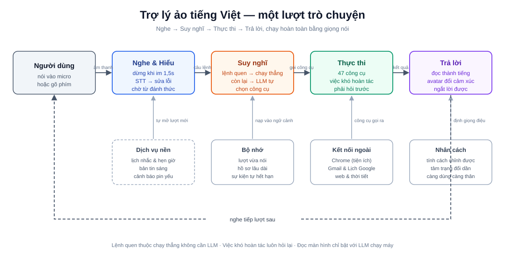
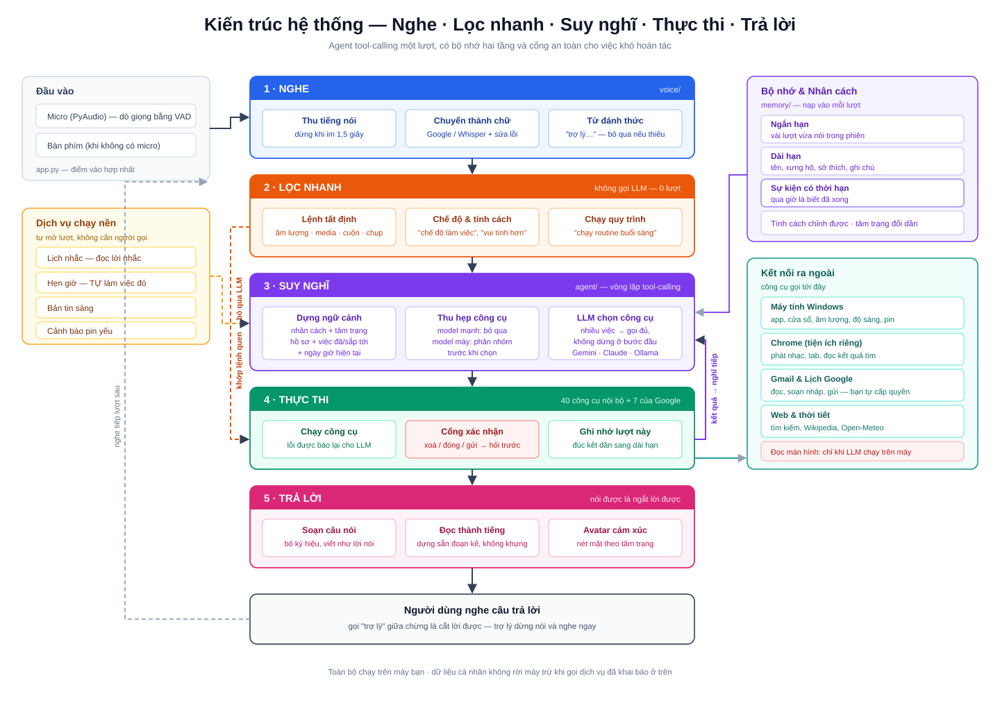

# Trợ lý ảo tiếng Việt cho Windows

> Nói một câu, máy tính làm việc đó. Trợ lý chạy ngay trên máy bạn, nghe tiếng Việt, tự chọn
> công cụ để thực thi, rồi trả lời bằng giọng nói — kèm một avatar biết đổi nét mặt.



Khác với trợ lý dò từ khoá, hệ thống này dùng **LLM tự gọi công cụ** (tool-calling): bạn nói
kiểu gì cũng được, model tự hiểu và chọn đúng việc cần làm với đúng tham số. Nói *"mở Chrome
rồi tăng âm lượng lên 60"* thì nó làm **cả hai việc**, không dừng ở việc đầu.

---

## Trợ lý làm được gì

**🖥️ Điều khiển máy tính**
Mở/đóng ứng dụng, liệt kê và chuyển cửa sổ, chỉnh âm lượng và độ sáng, xem RAM/CPU/ổ đĩa/pin.

**🌐 Web & YouTube**
Tìm kiếm rồi **đọc danh sách kết quả** cho bạn chọn số, mở trang, phát nhạc/video, tra Wikipedia.

**🎬 Điều khiển Chrome**
Tạm dừng / phát tiếp / chuyển bài, chỉnh âm lượng video, quản lý tab — qua một tiện ích Chrome
riêng nói chuyện với trợ lý.

**📧 Email & Lịch Google**
Đọc mail chưa đọc, xem lịch hôm nay, và **tự soạn nội dung mail** từ ý định của bạn (*"viết mail
xin nghỉ phép gửi sếp"*) — lưu nháp hoặc gửi sau khi bạn xác nhận.

**📇 Danh bạ**
Nhớ email theo tên, nên lần sau chỉ cần nói *"gửi cho sếp"* thay vì đọc cả địa chỉ.

**⏰ Nhắc việc & tự động**
Phân biệt rõ *"nhắc tôi uống nước lúc 3h"* (chỉ nhắc) với *"22h30 mở YouTube"* (tự làm thật).
Có danh sách việc cần làm, quy trình nhiều bước (routine), bản tin sáng và cảnh báo pin yếu.

**🧠 Trí nhớ**
Nhớ tên, cách xưng hô, sở thích qua mọi phiên. Quan trọng hơn: **phân biệt việc đã xong với
việc sắp tới** — buổi phỏng vấn lúc trưa thì tối nó biết là chuyện đã qua, không nhắc như sắp
diễn ra nữa.

**🎭 Nhân cách**
Tính cách chỉnh được bằng lời (*"vui tính hơn"*, *"nghiêm túc hơn"*), tâm trạng thay đổi dần
theo cuộc trò chuyện và dẫn nét mặt avatar. Càng dùng càng xưng hô thân hơn.

**🖼️ Đọc màn hình** *(tắt mặc định)*
Chụp màn hình, tìm chữ bằng OCR, cuộn trang. Chỉ chạy khi bạn bật **và** đang dùng LLM trên máy.

---

## Kiến trúc



Mỗi lượt đi qua năm chặng. Ba điểm đáng chú ý trong thiết kế:

**Lệnh quen thuộc không tốn LLM.** Chỉnh âm lượng, tạm dừng nhạc, cuộn màn hình… được nhận
dạng thẳng và chạy ngay — vừa tức thì, vừa chắc chắn chạy kể cả khi model lười gọi công cụ.

**Việc khó hoàn tác luôn phải hỏi.** Xoá, đóng ứng dụng, gửi mail đều bị chặn lại ở một cổng
xác nhận **nằm trong code**, nên nghe nhầm hay model hiểu sai cũng không lỡ tay.

**Bộ nhớ hai tầng, có mốc thời gian.** Trợ lý luôn biết bây giờ là mấy giờ, và tách sự thật
bền vững (tên, sở thích) khỏi sự kiện có hạn (cuộc hẹn) — nhờ vậy nó không nhắc mãi một việc
đã xong.

### Cây thư mục

Các phần chính (lược bớt vài thư mục cũ chưa dùng tới):

```
src/
├── app.py            Điểm vào: ghép agent + avatar + giọng nói + dịch vụ nền
├── agent/            Vòng lặp tool-calling, định nghĩa công cụ, nhân cách
├── memory/           Bộ nhớ: ngắn hạn, dài hạn, sự kiện, mốc thời gian
├── llm/              Kết nối Gemini / Claude / Ollama + nội dung prompt
├── voice/            Thu tiếng, nhận dạng, đọc thành tiếng, lệnh nhanh
├── actions/          Hành động thật: hệ thống, web, màn hình, thời tiết
├── services/         Lịch nhắc, việc cần làm, danh bạ, cầu nối Chrome & Google
├── ui/               Cửa sổ avatar
├── utils/            Cấu hình, log, chuẩn hoá văn bản
└── evals/            Đo độ tin cậy chọn công cụ + chi phí mỗi lượt
mcp_servers/          Máy chủ Gmail + Lịch Google (chạy local)
chrome_extension/     Tiện ích Chrome (nằm ngoài repo)
tests/                493 test, không cần micro hay API key
```

---

## Cài đặt

**Cần có:** Python 3.9+ · Windows · micro (tuỳ chọn — không có thì gõ phím)

```bash
python -m venv .venv
.venv\Scripts\activate
pip install -r src/requirements.txt
```

Rồi chọn **một** nguồn LLM và tạo file `src/.env`:

<details>
<summary><b>Gemini</b> — nhanh, miễn phí, khuyến nghị</summary>

```env
LLM_PROVIDER=gemini
GEMINI_API_KEY=<khoá của bạn>
GEMINI_MODELS=gemini-3.1-flash-lite:15:500,gemini-flash-lite-latest:0:0
```

Cú pháp `tên:RPM:RPD` — hết lượt model này thì tự chuyển model kế. Đặt `0:0` nếu không rõ hạn mức.
</details>

<details>
<summary><b>Ollama</b> — chạy hẳn trên máy, không cần mạng</summary>

```env
LLM_PROVIDER=ollama
OLLAMA_MODEL=qwen2.5:7b-instruct
```

Cài [Ollama](https://ollama.com) rồi `ollama pull qwen2.5:7b-instruct`. Model **phải hỗ trợ
tool-calling**. Model càng nhỏ chọn công cụ càng kém — dưới 7B thường không dùng được.
</details>

<details>
<summary><b>Claude</b></summary>

```env
LLM_PROVIDER=claude
ANTHROPIC_API_KEY=<khoá của bạn>
```
</details>

## Chạy

```bash
cd src && python app.py
```

Mặc định phải gọi tên trước: **"trợ lý, mở Chrome"**. Nói *"trợ lý, chế độ làm việc"* để tạm
tắt phần gọi tên, *"chế độ bình thường"* để bật lại. Không có micro thì trợ lý tự chuyển sang
gõ phím.

Thử vài câu:

```
trợ lý, mở Chrome rồi tăng âm lượng lên 60
trợ lý, thời tiết Đà Lạt hôm nay thế nào
trợ lý, nhắc tôi uống nước sau 10 phút
trợ lý, tìm thông tin về trạm vũ trụ ISS
trợ lý, hôm nay tôi có lịch gì
trợ lý, vui tính hơn chút đi
```

---

## Cấu hình

Toàn bộ tham số nằm trong `src/utils/config.py`, ghi đè được bằng `src/.env`. Những mục hay dùng:

| Biến | Mặc định | Ý nghĩa |
|---|---|---|
| `LLM_PROVIDER` | `ollama` | `gemini` \| `claude` \| `ollama` |
| `ROUTER_MODE` | `auto` | `auto` tự tắt bước phân loại với model mạnh để bớt một lượt gọi |
| `SILENCE_DURATION` | `1.5` | Im lặng bao nhiêu giây thì coi là bạn đã nói xong |
| `WAKE_WORDS` | `trợ lý,jarvis,…` | Từ đánh thức, cách nhau bởi dấu phẩy |
| `REQUIRE_WAKE_WORD` | `true` | Tắt nếu muốn ra lệnh trực tiếp |
| `INPUT_MODE` | `auto` | `auto` \| `voice` \| `text` |
| `TTS_SPEED` | `1.0` | Tốc độ đọc; `TTS_ROBOT=true` cho giọng robot |
| `PERSONA_ENABLED` | `true` | Nhân cách + tâm trạng dẫn nét mặt avatar |
| `LTM_AUTO_EXTRACT` | `false` | Tự đúc kết trí nhớ dài hạn (tốn thêm lượt gọi LLM) |
| `SCREEN_CONTROL_ENABLED` | `false` | Đọc màn hình — chỉ chạy với LLM trên máy |
| `MCP_ENABLED` | `false` | Bật Gmail & Lịch Google |
| `WEATHER_DEFAULT_LOCATION` | `Hà Nội` | Nơi mặc định khi hỏi thời tiết |

### Bật Gmail & Lịch Google

Máy chủ chạy **local**, dùng OAuth của chính bạn, token nằm trên máy bạn.

```bash
cd mcp_servers
pip install -r requirements.txt
python google_personal.py --setup      # mở trình duyệt để bạn cấp quyền
```

Tạo OAuth client (Desktop) trong Google Cloud Console, tải `credentials.json` về đặt cạnh file
trên, rồi thêm vào `src/.env`:

```env
MCP_ENABLED=true
MCP_COMMAND=<đường dẫn python của môi trường ảo>
MCP_ARGS=<đường dẫn tuyệt đối tới mcp_servers/google_personal.py>
MCP_TOOL_PREFIX=gws_
```

### Bật điều khiển Chrome

Vào `chrome://extensions` → bật Developer mode → *Load unpacked* → chọn thư mục
`chrome_extension/`. Sau mỗi lần sửa tiện ích nhớ bấm **Reload**.

---

## Kiểm thử

```bash
pip install -r requirements-dev.txt
pytest
```

493 test — **không** mở ứng dụng thật, không cần micro hay API key (LLM và các hành động đều
được thay bằng bản giả).

Ngoài ra có bộ đo riêng để kiểm xem model chọn công cụ đúng đến đâu và mỗi lượt tốn bao nhiêu
lần gọi LLM:

```bash
cd src && python -m evals.run_eval --gap=9
```

---

## Bảo mật & riêng tư

- Cầu nối Chrome chỉ lắng nghe ở `127.0.0.1` và **chỉ nhận kết nối từ tiện ích**, website
  không giả mạo được.
- Hành động khó hoàn tác bị chặn ở cổng xác nhận **trong code**, không phụ thuộc model.
- Đóng ứng dụng chạy qua danh sách tham số, không qua shell — không chèn lệnh được.
- Hồ sơ, nhân cách, danh bạ, token Google đều nằm trên máy bạn và đã được loại khỏi repo.
- Đọc màn hình **tự tắt** khi dùng LLM trực tuyến, để nội dung màn hình không rời máy.

## Hạn chế đã biết

- **Windows only** — điều khiển hệ thống dựa vào thư viện riêng của Windows.
- **Chất lượng phụ thuộc model.** Model nhỏ chạy máy hay chọn sai hoặc quên gọi công cụ; hệ
  thống có sẵn nhiều lớp bù nhưng không thay thế được model tốt.
- **Chưa khử vọng âm.** Ngắt lời giữa chừng hoạt động nhưng không hoàn hảo vì micro vẫn nghe
  thấy chính giọng trợ lý.
- **Đọc kết quả tìm kiếm dựa vào cấu trúc trang Google/DuckDuckGo** — hai trang này đổi giao
  diện thì phải chỉnh lại.
- **Nội dung web và chữ trên màn hình là dữ liệu không đáng tin.** Trợ lý có thể bị dẫn dụ bởi
  chỉ dẫn giấu trong đó; cổng xác nhận là lớp phòng vệ chính.
