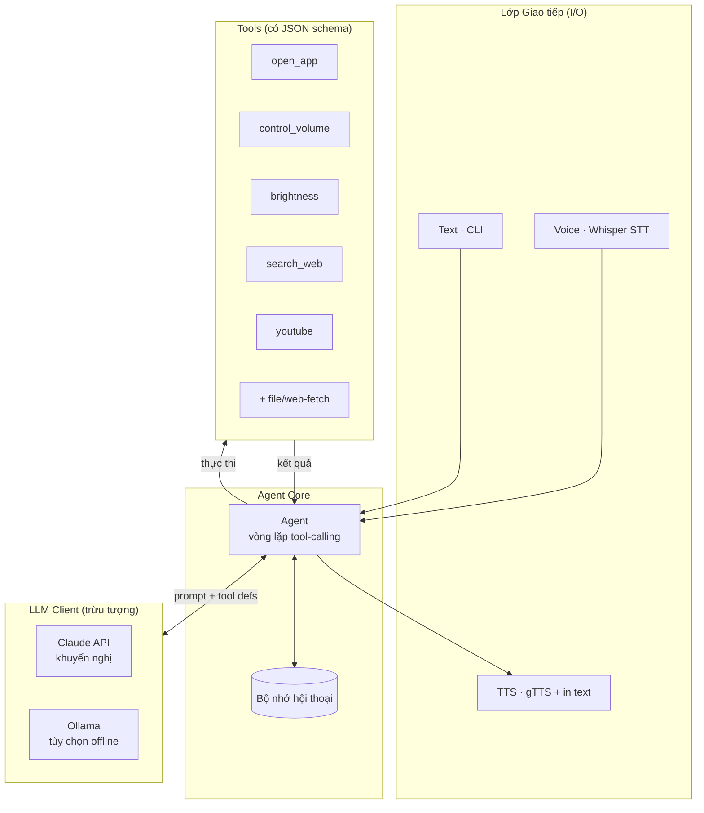
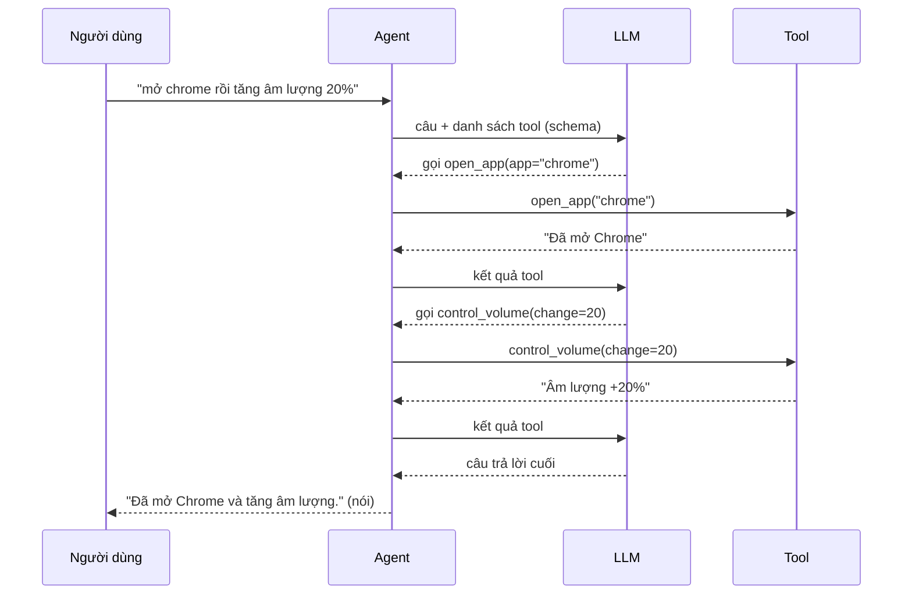

# Kiến trúc & Tầm nhìn

> Tài liệu định hướng cho lần tái cấu trúc lớn: chuyển từ *pipeline NLP tự xây*
> (intent classifier + entity extractor + registry) sang **LLM agent tool-calling**.

## Tầm nhìn (North Star)

**Một AI agent điều khiển máy tính bằng tiếng Việt (giọng nói hoặc văn bản), dùng
LLM tool-calling để thực thi tác vụ.**

Người dùng nói/gõ một yêu cầu tự nhiên → LLM tự hiểu và **gọi đúng công cụ** với
đúng tham số → trả lời bằng giọng nói. Không còn đếm từ khóa, không còn `if/elif`.

Dự án là **portfolio** thể hiện kiến trúc agent hiện đại: vòng lặp tool-calling,
tách lớp sạch, có kiểm thử.

## Mục tiêu & Giới hạn

| Mục tiêu (in-scope) | Ngoài phạm vi (non-goals) |
|---|---|
| Hiểu yêu cầu tiếng Việt tự nhiên qua LLM | Tự train/fine-tune model NLP |
| Điều khiển Windows: app, âm lượng, độ sáng, web, YouTube | Đa nền tảng (macOS/Linux) — có thể tính sau |
| Tool-calling có schema rõ ràng, dễ thêm tool | Giao diện web/mobile |
| Nhập bằng giọng nói (Whisper) **và** văn bản | Realtime streaming voice phức tạp |
| Có unit test cho agent core | Độ trễ cực thấp |

## Kiến trúc tổng thể

## Vòng lặp tool-calling

## Trách nhiệm từng thành phần

| Lớp | Module | Trách nhiệm |
|---|---|---|
| Giao tiếp | `audio/`, `recognition/` | Ghi âm, STT (Whisper), TTS. Không chứa logic hiểu lệnh. |
| Agent core | `core/agent.py` | Chạy vòng lặp: gọi LLM → thực thi tool → lặp đến khi có câu trả lời. |
| Tools | `core/tools.py`, `core/actions_facade.py` | Định nghĩa tool (tên, mô tả, schema) + hàm thực thi. |
| LLM | `core/llm_client.py` | Interface chung; hiện thực Claude / Ollama. |
| Nền tảng | `utils/config`, `utils/logger`, `components/user` | Cấu hình, log, hồ sơ người dùng, bộ nhớ. |

## Giữ / Bỏ / Thêm

| | Thành phần | Ghi chú |
|---|---|---|
| ✅ Giữ | `core/actions_facade.py` | Trở thành phần thực thi của tools. |
| ✅ Giữ | `audio/`, `recognition/`, `utils/`, `components/user/`, `tests/` | Lớp I/O & nền tảng. |
| ❌ Bỏ | `nlp/nlp_model.py` (PhoBERT), `nlp/intent_classifier`, `nlp/entity_extractor` | LLM tool-calling thay thế. Gỡ torch/transformers khỏi luồng chính. |
| 🔄 Thay | `core/command_router.py` | → `core/agent.py` (tool-loop). |
| 🔄 Thay | `llm/conversation_engine`, `llm/pattern_matcher`, `llm/ollama_client` | → một `llm_client` hỗ trợ tool-calling. |
| ➕ Thêm | `core/tools.py`, `core/agent.py`, `core/llm_client.py`, bộ nhớ bền vững, tool file/web | Phần tạo giá trị "agent". |

## Lộ trình

- **Phase A — Agent core (text-first):** tool registry + schema, `Agent` tool-loop,
  chạy bằng text, có test với LLM giả. Gỡ pipeline NLP cũ.
- **Phase B — Gắn lại giọng nói:** Whisper → agent → TTS.
- **Phase C — Mở rộng tool:** file ops, web-fetch + tóm tắt.
- **Phase D — Đánh bóng portfolio:** README + sơ đồ, demo, CI.

## Quyết định công nghệ

- **LLM:** khuyến nghị **Claude API** làm chính (tool-calling chất lượng cao, hợp
  để showcase), thiết kế client **pluggable** để thêm Ollama (offline) sau.
- **Ngôn ngữ:** Python 3.9+ (giữ nguyên).
- **Nền tảng:** Windows desktop.
- **Kiểm thử:** pytest, agent core test được nhờ tiêm LLM client giả.
